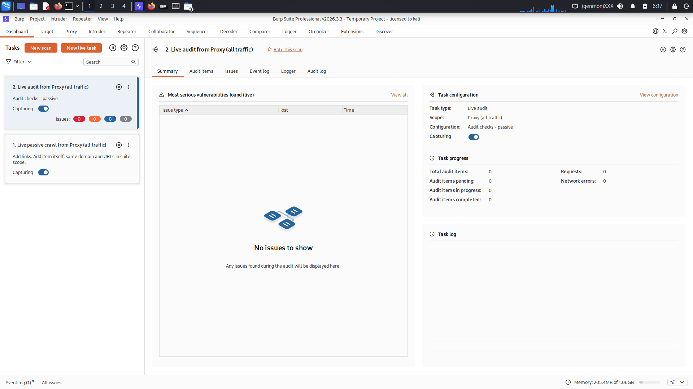
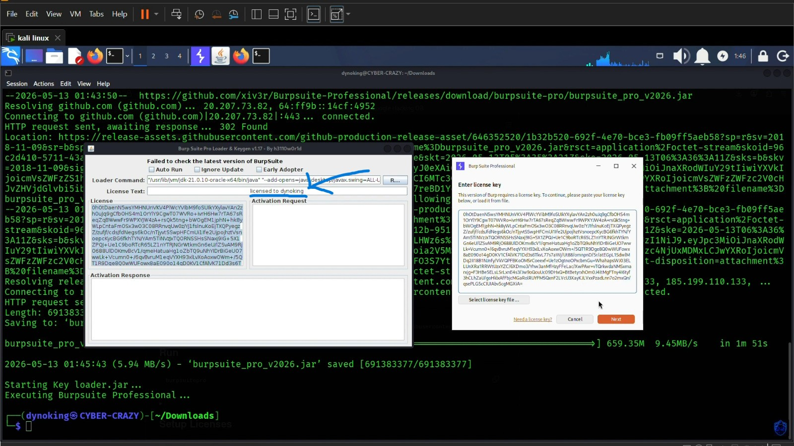
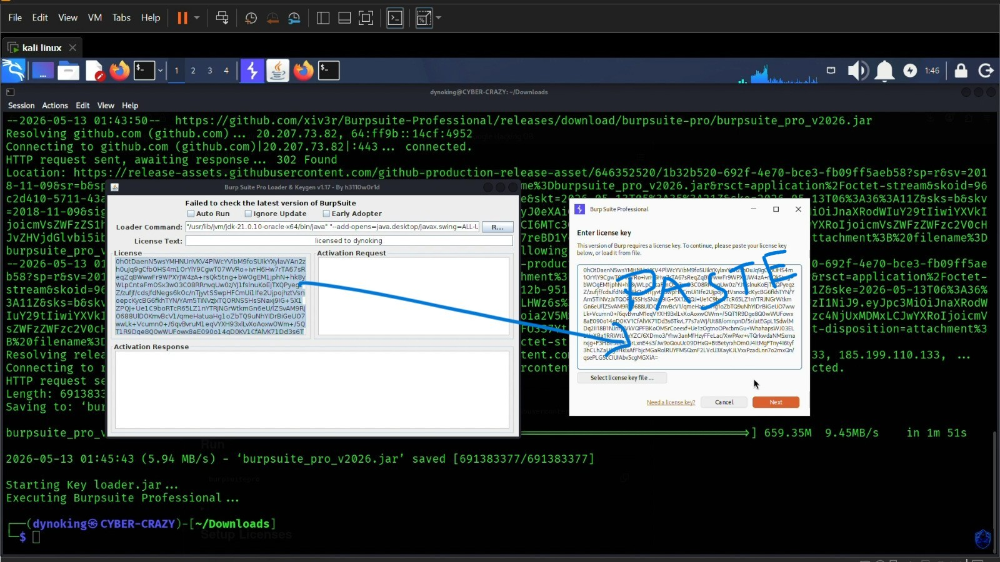
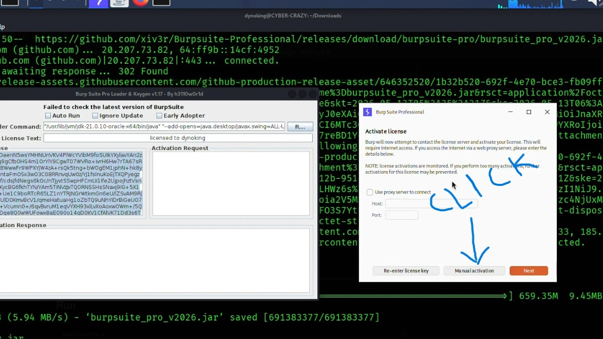
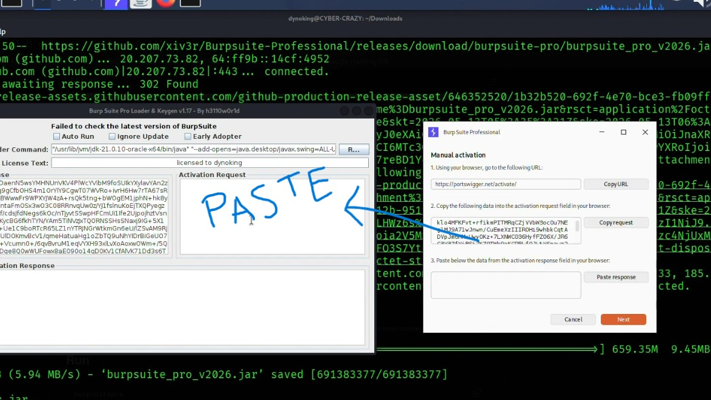
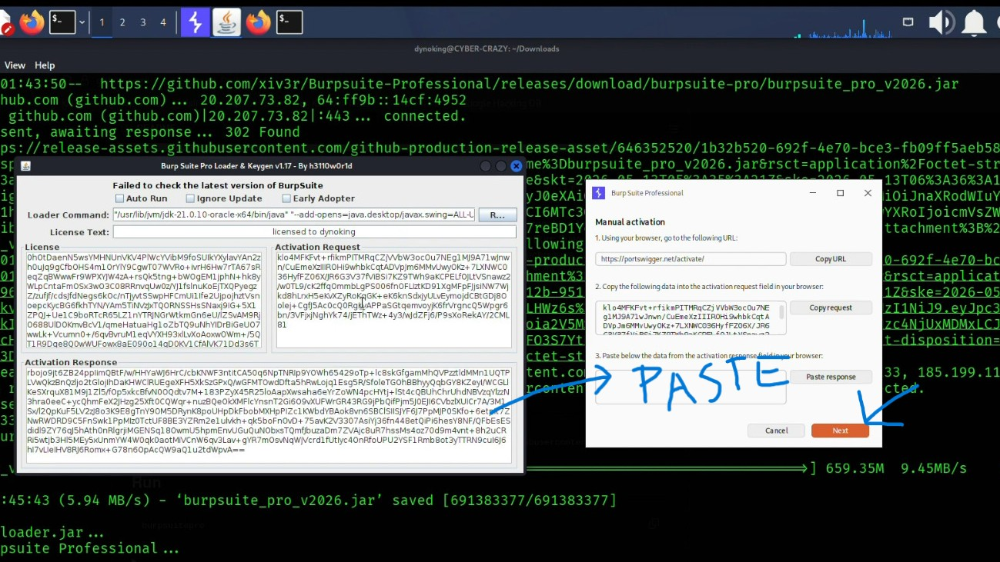
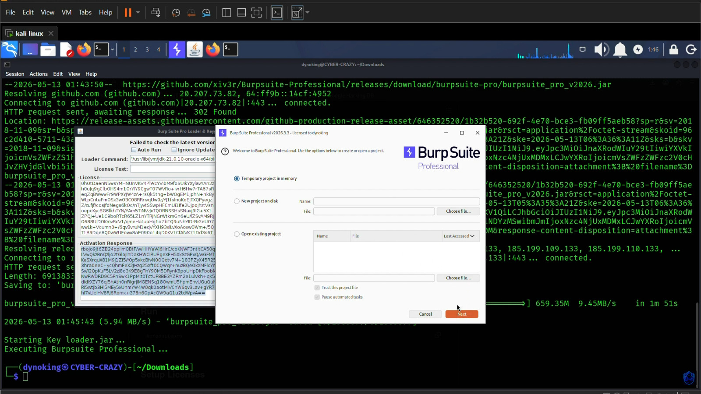

# Burpsuite-Professional − v 2026 − latest

Step-by-step guide to install Burp Suite Professional on Kali Linux.

# Burp Suite Professional Installation Guide (Kali Linux)

## Step 1: Update System Packages

Before starting the installation, update the system package list.

```bash
sudo apt update
```

---

## Step 2: Download JDK 21

1. Open **Firefox**.
2. Search for **JDK 21**.
3. Open the **Java SE 21 Archive Downloads** page.
4. Scroll down to **Java SE Development Kit 21.0.11**.
5. Download the package according to your system.
6. For Kali Linux (64-bit), download:

**Linux x64 Debian Package (.deb)**

---

## Step 3: Install JDK 21

Open the terminal and navigate to the **Downloads** directory.

```bash
cd ~/Downloads
ls
sudo dpkg -i jdk-21.0.11_linux-x64_bin.deb
```

---

## Step 4: Install Burp Suite Professional

Run the following command in the terminal:

```bash
sudo apt update && sudo apt install -y wget && wget -qO- https://raw.githubusercontent.com/xiv3r/Burpsuite-Professional/main/install.sh | sudo bash
```


## Step 5: Update the License Text

In the **License Text** field, replace the default name with your own system or username.

**Example:**

Before:
License to h3ll0w0rld

After:
License to dynoking

### Output


*Figure 5: Burp Suite Professional initial setup screen.*


## Step 6: Enter the License Key

When the **Enter License Key** window appears, enter your valid Burp Suite Professional license key and click **Next** to continue.

**Output:**



*Figure 6: Enter your Burp Suite Professional license key.*


## Step 7: Manual Activation

Click **Manual Activation**.

> ⚠️ **Important:** Do **NOT** click **Next** by mistake.

**Output:**




## Step 8: Copy the Activation Request

Copy the data shown under **"Copy the following data into the Activation Request field in your browser."**

Then, paste it into the **Activation Request** field in your browser.

**Output:**




## Step 9: Paste the Activation Response

Copy the data from the **Activation Response** field in your browser.

Then, paste it into the field labeled **"Paste below the data from the Activation Response field in your browser."**

**Output:**



## Step 10: Complete the Activation

Once the activation is completed successfully, **Burp Suite Professional** will start and be ready to use.

**Output:**



## Step 11. Run Burp Suite Professional

Open a terminal and run the following command:

```bash
sudo burpsuitepro
```

This will launch **Burp Suite Professional**.


